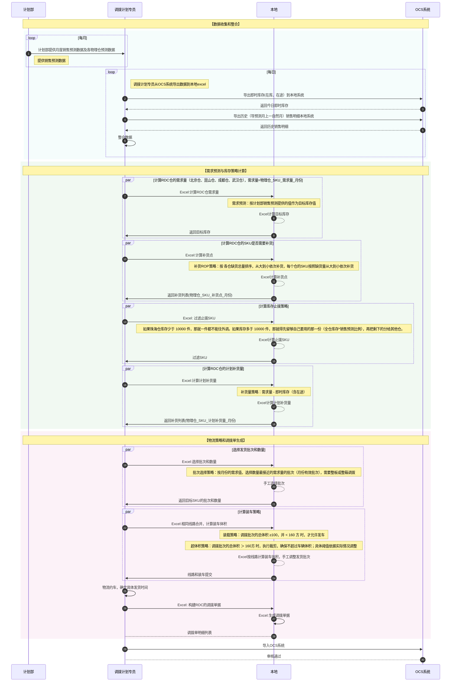
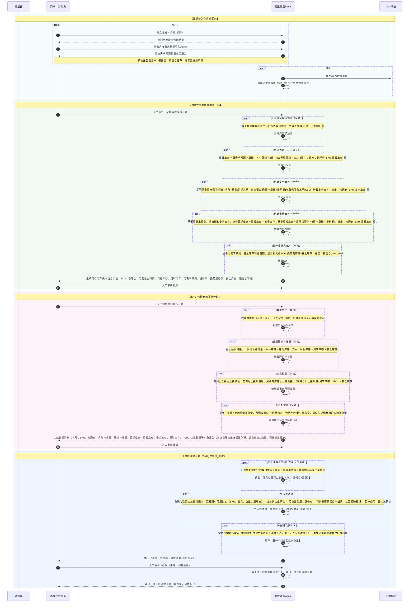
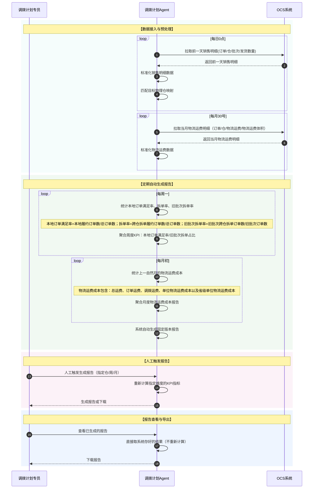

# 调拨计划蓝图

## 一、现状运营流程（时序图）

以下时序图展示了运营、本地系统、OCS系统之间的交互关系，基于现网的实际业务逻辑。

## 二、 现状存在的问题

## 📌 问题与优化空间

| 问题分类 | 现状问题 | 优化空间 |
|----------|----------|----------|
| **数据收集与整合** | 1. 销售预测与即时库存需人工汇总，操作繁琐、易出错 | 1. 每月将销售预测数据导入 Agent 后，Agent 每天自动同步库存，Agent自动汇总统计数据 |
| **计算 RDC 需求量** | 1. 我们对 2025-02-06 的对照统计显示：预测与实际销售偏差强度约 78%，仅依赖销售预测不足以抵消月内波动。 如果只把“销售预测”作为目标库存，虽然能够覆盖整月的总需求，但无法反映月内的波动，导致 RDC 容易出现缺货。 **例**：成都仓，月销售预测=10,000，但当月实际销售=15,000，超出的 5,000 并未被预测覆盖，只能依靠“安全库存”来做缓冲。 | 1. 因为单纯依赖“销售预测”无法消除月内波动，容易导致 RDC 缺货，所以需要增加安全库存，用来抵消预测的波动性，从而提高整体预测的稳定性和准确性。  2. （二期实现）给商品按销量波动性打标签：低波动类商品可设高服务水平并配较高的安全库存保障供应，高波动类商品只设低服务水平并配较低的安全库存以避免积压。 **例**：某 SKU 每天都卖 200 件，很稳定 → 属于低波动类，适合配高安全库存；某 SKU 有时卖 200 件，有时卖 0 件，忽高忽低 → 属于高波动类，只适合配低安全库存。  |
| **补货策略** | 1. 补货周期：目前按月补货，导致在库水位偏高。当珠海仓库存不足以覆盖全部 RDC 需求时，各 RDC 会按“月目标差额”争抢，容易造成一边过量、一边缺货。 **例**：成都仓在库 = 500，月销售预测 = 4000；若珠海仓某批次有 1500 库存并直接全部补给成都仓，则珠海仓自身库存将低于月销售预测，导致其他 RDC 无法获得补货。  2. 补货时机：人工判断规则“缺货最多优先补”，容易过早或过晚。 **例**：成都仓在库= 500，月销售预测= 4000，按规则需补 3500。但结合日均预测销量 100（假设） 来看，现有库存可支撑 5 天（500 ÷ 100 = 5），而运输提前期仅 3 天，因此仓库还有 2 天缓冲期。理论上可暂缓补货，把资源优先分配给更紧缺的 RDC。  3. 补货数量：现状主要参考批次数量和销售预测，通常一次只补一个批次，补多少取决于批次库存，若只看单批次库存来补货，而不是按需求缺口来算，可能出现补货量偏大或偏小，导致RDC库存被动拉高或仍然缺货。 **例**：成都仓在库 =500，月销售预测= 4000，如果直接用珠海仓单批次 1500 来补货，看似补足，但并不知道能支撑几天。如果成都仓日均销量预测只有 100，这批货可以撑 15 天，就会造成库存积压；如果日均预测销量高达 500，这批货只能撑 3 天，很快又会缺货。 | 1. 补货周期从原来的月改为周，可以降低目标库存。 **例**：成都仓在库=500，月销售预测=4000；若转为周度补货，周均销售预测=1000，则只需补 500，其余 3000 可用于其他 RDC。  2. 增加补货点统计值，当即时库存（含在途） < 补货点时触发补货。 **例**：成都仓在库=500，周销售预测=1000，日均销售预测=100，运输期=3 天；只要库存 ≥300（3×100），就可暂不补货。  3. 增加补货量统计值，防止补多/补少。 **例**：成都仓在库= 500，周销售预测 =1000，只需补足缺口 500，如单批次不够则混合批次，既能满足需求又避免浪费。 |
| **批次策略** | 1. 补货策略与履约策略冲突。现状只补近 3 个月批次，旧批留在珠海仓。导致订单从珠海仓发货，影响本地订单履约率。  2. 调拨近 3 个月的批次，如果 RDC 没有销量，那么新批次也会逐渐变为旧批次。我们对 2025-02～06 的本地履约率统计显示，整体拆单率约为 55%，其中由旧批次驱动的拆单比例达到 32.9%，并且在 2～6 月逐月升高，说明旧批次的累积正在推动拆单率不断上升。 | 1. 旧批次库存按各 RDC 的销售占比分配，确保旧批次在高销量仓优先消化，避免积压或缺货。 **例子**：某 SKU 有旧批次库存 1000 件，北京/昆山/成都 3 个 RDC 的预测销量占比分别为 30% / 50% / 20%。按规则应分配：北京 300 件、昆山 500 件、成都 200 件。 |
| **止拨策略** | 1. 止拨策略采用月预测，使珠海仓保留了高水位库存，导致 RDC 缺货，同时没有加入安全库存来抵消预测波动。 **例**：成都仓在库=500，月销售预测=4000；珠海仓在库=5000，月销售预测=5000；按照规则，不能进行调拨，此时会导致 RDC 缺货。 | 1. 优化珠海仓的止拨数量=周需求预测+安全库存，提高资源利用率。 **例**：成都仓在库=500，周销售预测=1000；珠海仓在库（含待检）=5000，周销售预测=1000，安全库存=500；那么珠海仓的止拨阈值=1500（1000+500），因此有 3500 的富余库存可用于给其他 RDC 补货。 |

---

***说明：**    
- 目标库存：=周转库存+安全库存  
- 周转库存：=周需求预测*周期（比如1周+运输期3天≈1.4周）
- 安全库存：SS = z × σ_pp
  -	**例子**：某 SKU 每周平均卖 100 件，销量有时多 20 有时少 20，历史误差的平均波动幅度约 16 件（σ_PP≈16）。若希望 95% 的订单能被满足（z=1.65），就需要额外准备约 27 件安全库存（=1.65×16）。
  - σ_PP（需求波动）：反映历史预测和实际销量的误差有多大波动，波动越大说明越不稳定，需要更多安全库存。
  - z（服务水平系数）：表示希望多少比例的订单能被满足，比如设定 95% 的服务水平，对应 z=1.65，就是要把库存放大到能覆盖绝大多数需求波动。
  

## 三、改造后的场景及运营流程

### 生成调拨计划

---

### KPI 报告

## 附录 指标统计
### RDC仓 月度指标（A.A品类，2025-02至2025-06）

口径：SKU前缀为“A.A”，按仓×月统计 WMAPE、MAPE、期间偏差率。

#### 月均（各仓简单平均）
|仓|月均WMAPE|月均MAPE|月均期间偏差率|覆盖月份数|
|:--|--:|--:|--:|--:|
|珠海仓|78.83%|264.80%|40.34%|5|
|北京仓|68.32%|106.69%|-37.27%|5|
|成都仓|92.28%|238.74%|19.40%|5|
|昆山仓|66.67%|83.25%|-48.99%|5|
|均值|76.53%|173.37%|-6.63%|5|

#### 按仓 wMAPE（2025-02至06）
|月份|仓|WMAPE|MAPE|期间偏差率|预测合计|实际合计|样本数|
|:--|:--|--:|--:|--:|--:|--:|--:|
|2025-02|珠海仓|52.40%|185.55%|-15.84%|850954|1011079|99|
|2025-03|珠海仓|109.75%|488.00%|83.56%|3038940|1655516|102|
|2025-04|珠海仓|93.94%|435.56%|60.97%|3411410|2119336|106|
|2025-05|珠海仓|87.66%|110.63%|56.47%|4149817|2652111|109|
|2025-06|珠海仓|50.39%|104.26%|16.55%|2791055|2394664|108|
|2025-02|北京仓|62.13%|110.67%|-34.03%|251074|380614|83|
|2025-03|北京仓|72.94%|183.09%|-64.10%|347911|969225|82|
|2025-04|北京仓|61.04%|67.19%|-52.11%|537642|1122695|80|
|2025-05|北京仓|78.85%|88.05%|-47.12%|579158|1095258|86|
|2025-06|北京仓|66.64%|84.45%|11.02%|1361701|1226581|82|
|2025-02|成都仓|75.94%|253.71%|33.15%|419186|314832|81|
|2025-03|成都仓|125.90%|327.75%|6.74%|587809|550683|80|
|2025-04|成都仓|67.51%|125.44%|-10.88%|729138|818138|73|
|2025-05|成都仓|97.88%|220.37%|-2.28%|718102|734889|84|
|2025-06|成都仓|94.18%|266.44%|70.28%|1301306|764211|83|
|2025-02|昆山仓|67.21%|97.50%|-36.43%|200903|316013|81|
|2025-03|昆山仓|66.63%|112.02%|-49.54%|274689|544390|81|
|2025-04|昆山仓|68.76%|67.49%|-65.62%|388493|1130061|81|
|2025-05|昆山仓|71.01%|74.14%|-63.57%|338859|930090|85|
|2025-06|昆山仓|59.73%|65.08%|-29.79%|691582|985085|86|

- WMAPE（加权平均绝对百分比误差）：衡量预测误差在总需求中的占比，数值越低越好。
- **例子**：这 3 周一共卖了 600 件，预测一共错了 90 件（绝对值）。错误占比 = 90 ÷ 600 = 15%。所以这个预测模型的 加权平均误差率 = 15%。
- MAPE（平均绝对百分比误差）：衡量预测误差的平均水平，不考虑需求规模，容易受小样本影响。
- **例子**：这 3 周卖了 600 件，预测分别错了 30、30、30 件。每周的错误率分别是 30 ÷ 100 = 30%、30 ÷ 200 = 15%、30 ÷ 300 = 10%。所以这个预测模型的 平均误差率 = (30% + 15% + 10%) ÷ 3 = 18.33%。
- 期间偏差率：衡量预测合计与实际合计的整体偏差方向，正值说明预测高估，负值说明预测低估。
- **例子**：这 3 周一共卖了 600 件，预测一共卖了 690 件。期间偏差率 = (690 - 600) ÷ 600 = 15%。说明整体预测高估了 15%。

### 结论
- 整体预测误差偏高（WMAPE 平均 76.53%），说明当前预测结果与实际需求存在明显差距。
- 珠海仓普遍高估，容易形成库存积压；北京仓和昆山普遍低估，存在缺货风险；成都仓波动较大，增加了计划和执行的难度。
- 行业经验表明，合理的预测误差应控制在 10%~20% 之间。要提升准确性，需要进一步优化预测口径和方法。

### 本地订单满足率 
| month/月   |   total_orders_expected/总订单数 |   local_orders_fulfilled/本地履约订单数 |   total_orders_cross_entire/跨仓整单履约订单数 |   total_orders_cross_split/跨仓拆单履约订单数 | local_fill_rate/本地订单满足率   | cross_split_rate/拆单率   |
|:-----------|---------------------------------:|----------------------------------------:|-----------------------------------------------:|----------------------------------------------:|:---------------------------------|:--------------------------|
| 25-2       |                             1510 |                                     681 |                                            212 |                                           617 | 45.1%                            | 40.86%                    |
| 25-3       |                             2110 |                                     891 |                                            286 |                                           933 | 42.23%                           | 44.22%                    |
| 25-4       |                             2139 |                                     910 |                                            325 |                                           904 | 42.54%                           | 42.26%                    |
| 25-5       |                             2208 |                                     988 |                                            298 |                                           922 | 44.75%                           | 41.76%                    |
| 25-6       |                             1982 |                                     805 |                                            282 |                                           895 | 40.62%                           | 45.16%                    |

- 本地履约订单数：实际发货仓与预计发货仓相同的渠道订单数
- 跨仓整单履约订单数：订单未拆单，实际发货仓与预计发货仓不一致的渠道订单数
- 跨仓拆单履约订单数：订单拆单，任一子单的实际发货仓与预计发货仓不一致的渠道订单数
- 本地订单满足率 = 本地履约订单数 / 总订单数 × 100%
- 拆单率 = 跨仓拆单履约订单数 / 总订单数 × 100%
### 旧批次履约占比 
| month/月   |   total_orders_expected/总订单数 |   old_batch_orders/旧批次订单数 |   old_batch_local_orders/旧批次本地订单数 |   old_batch_cross_entire_orders/旧批次跨仓整单履约订单数 |   old_batch_cross_split_orders/旧批次跨仓拆单履约订单数 | old_batch_rate_of_shipped/旧批次占比   | old_batch_cross_split_rate_of_shipped/旧批次拆单率   |
|:-----------|---------------------------------:|--------------------------------:|------------------------------------------:|---------------------------------------------------------:|--------------------------------------------------------:|:---------------------------------------|:-----------------------------------------------------|
| 25-2       |                             1463 |                             291 |                                        79 |                                                       10 |                                                     202 | 19.89%                                 | 13.81%                                               |
| 25-3       |                             2107 |                             475 |                                       108 |                                                       32 |                                                     335 | 22.54%                                 | 15.9%                                                |
| 25-4       |                             2140 |                             358 |                                       104 |                                                       20 |                                                     234 | 16.73%                                 | 10.93%                                               |
| 25-5       |                             2207 |                             562 |                                       241 |                                                       44 |                                                     277 | 25.46%                                 | 12.55%                                               |
| 25-6       |                             1985 |                             605 |                                       195 |                                                       69 |                                                     341 | 30.48%                                 | 17.18%                                               |
- 旧批次订单数：发货明细中批次的生产日期超过发货时间3个月以上的渠道订单数
- 旧批次本地订单数：旧批次订单中，实际发货仓与预计发货仓一致的渠道订单数
- 旧批次跨仓整单订单数：旧批次订单中，未拆单，且实际发货仓与预计发货仓不一致的渠道订单数
- 旧批次跨仓拆单订单数：旧批次订单中，拆单发货，且任一子单实际发货仓与预计发货仓不一致的渠道订单数
- 旧批次占比 = 旧批次订单数 / 总订单数 × 100%
- 旧批次拆单率 = 旧批次跨仓拆单订单数 / 旧批次订单数 × 100%

### 结论
- **本地履约率偏低**：整体维持在 40–45%，说明目标仓的库存保障能力不足。
- **旧批次占比上升**：旧批次比例逐月增加（20%→30%），意味着越来越多的订单需要优先消耗旧批次。
- **拆单问题加重**：当旧批次无法在本地被充分消化时，会触发跨仓消耗，导致更多订单被拆单、降低本地履约率。

### 安全库存
**例子**：某 SKU 在 3 周内预测误差分别是 0、+20、-20；
平均误差 = (0+20+(-20)) ÷ 3 = 0；
方差 = [(0-0)²+(20-0)²+(-20-0)²] ÷ 3 ≈ 266.7；
标准差 σ_PP = √266.7 ≈ 16。
若希望 95% 的订单能被满足（z=1.65），就需要额外准备约 27 件安全库存（=1.65×16）。